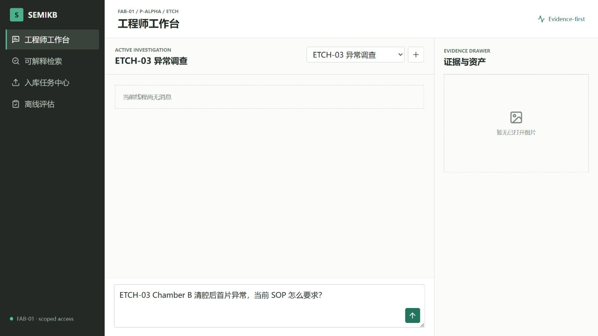

# T9-3 阿里云真机部署验收

## 1. 验收结论

2026-08-12，半导体 Agent 智库已在新 Alibaba Cloud Linux 4 测试 ECS 完成全栈单机部署。
本阶段完成主机准备、镜像构建、服务器专用配置、空存储初始化、受控合成语料发布、服务启动、
存储结构验证、公网 API 和浏览器工作台烟雾验证。

**T9-3 已完成，但 T9 尚未完成。** T9-4 仍需从用户操作视角复现上传、问答、图片、Trace、
离线评估，并执行容量、安全、冷备恢复和完整演示脚本验收。

## 2. 部署范围

| 项目 | 实际值 |
| --- | --- |
| 公网入口 | `http://112.74.99.143/` |
| 操作系统 | Alibaba Cloud Linux 4.0.4 |
| 规格 | 4 vCPU / 7.3 GiB / 79 GiB 根盘 |
| 容器运行时 | Moby 28.3.3 / containerd 1.7.34 |
| Compose | 2.26.1 |
| Git | 2.47.3 |
| 项目目录 | `/opt/semiconductor-agent-knowledge-base/` |
| 数据目录 | `/opt/semiconductor-agent-knowledge-base-data/` |
| 冷备目录 | `/opt/semiconductor-agent-knowledge-base-backups/` |
| 服务器配置 | 项目根目录 `.env`，权限 `600`，Git 未跟踪 |

未修改旧 CentOS，也未改动旧环境的 MongoDB、Milvus、MinIO、Attu、Redis、网络、端口或数据卷。

## 3. 安全组与端口

- 公网 `80/tcp` 已开放，供当前测试 HTTP 访问。
- 无用的 Windows RDP `3389/tcp` 已删除。
- MongoDB、Milvus、MinIO、etcd、Redis 端口未配置宿主机映射，也未加入安全组。
- 宿主机实际监听中，对外业务端口只有 `22` 和 `80`；其余监听均为回环地址。
- 无测试访问码请求 `/api/v1/auth/demo-token` 返回 `401`。
- Milvus 配置密码可连接，默认 `root:Milvus` 被拒绝。

测试期按用户明确批准暂时保留 `22/tcp` 对 `0.0.0.0/0` 和密码登录，以适应不同办公地点。
该项是限时风险例外，不满足正式生产安全标准。正式发布前必须改为密钥登录并限制来源，或使用
堡垒机、VPN 等受控运维通道。

## 4. 镜像与网络事实

ECS 可访问 Python 与 npm 包源，但直连 Docker Hub 超时；账号专属 ACR 加速地址未命中全部固定
镜像标签。为完成首次拉取和镜像构建，本次临时使用以下受控路径：

1. SSH 反向转发仅绑定 ECS `127.0.0.1`。
2. 构建阶段临时桥接 Docker 网桥到该回环转发。
3. 预拉取 Compose 所需的全部固定镜像。
4. 构建 API、Worker、Milvus Init 与 Web 镜像。
5. 完成后删除临时桥接脚本、进程和 Docker 代理设置。

服务器当前没有持久个人代理配置。后续迁移优先将已验收镜像同步到项目专属 ACR，避免依赖个人
网络；若暂时仍使用预拉取方式，必须把代理限定在部署窗口并在验收后清理。

Python 构建最初因宽泛依赖范围发生长时间解析回溯。当前已提交带 SHA-256 的
`requirements.lock`，Docker 使用 `pip install --require-hashes`，应用通过 `PYTHONPATH=/app/src`
加载源码，构建可重复且不会在线重新求解版本。

## 5. Milvus 启动故障与修复

首次启动时，Milvus 2.5.5 退出码为 134，日志核心错误为：

```text
DataCoord fail to create net listener
listen tcp :19530: bind: address already in use
```

根因不是内存或 PID 上限，而是项目把只有鉴权开关的 3 行 YAML 直接挂载到
`/milvus/configs/milvus.yaml`，覆盖镜像自带完整配置，组件端口默认值因此丢失。

修复后不再挂载局部 YAML。容器保留与镜像版本匹配的完整配置，只在启动时把
`authorizationEnabled: false` 原位改为 `true`，检查修改成功后再 `exec milvus run standalone`。
部署测试同时禁止重新引入局部配置挂载。修复提交为 `1aed815`；重建后 Milvus 在第三次健康探测
进入 `healthy`。

## 6. 服务运行结果

| 服务 | 状态 |
| --- | --- |
| API | 运行且健康 |
| Web / Nginx | 运行且健康，发布 `80:80` |
| Celery Worker | 运行，`inspect ping` 返回 `pong` |
| MongoDB 8.2.6 | 运行且健康 |
| Milvus 2.5.5 | 运行且健康 |
| Milvus MinIO | 运行且健康 |
| 业务 MinIO | 运行且健康 |
| etcd 3.5.18 | 运行且健康 |
| Redis 7.4.10 | 运行且健康 |
| Milvus Init | 一次性任务，退出码 0 |

公网检查：

- `GET /healthz` 返回 `200 {"status":"ok"}`。
- `GET /api/v1/live` 返回 `200 {"status":"ok"}`。
- `GET /` 返回前端 HTML 和 CSP、Frame、Referrer、Permissions 等安全响应头。

## 7. 数据与存储验收

`semikb.storage.preflight` 对 MongoDB、Milvus、MinIO、Redis 均返回可连接；
`semikb.storage.verifier` 的 MongoDB Collection/索引、MinIO 私有 Bucket、Milvus Schema/索引/Alias、
Redis 安全/AOF 检查全部通过。

| 存储 | 结果 |
| --- | --- |
| MongoDB | 7 Document、18 Chunk、2 ImageAsset、7 Job、49 Job Event、1 Index Release |
| MinIO | `semikb-raw` 7 个对象、`semikb-derived` 9 个对象，Bucket 无公开 Policy |
| Milvus | `semikb_chunks_v4` 强一致查询 15 个 Published Chunk |
| Alias | `semikb_chunks_active -> semikb_chunks_v4` |
| 索引 | 1024 维 Dense HNSW + Sparse Inverted Index |

MongoDB 的 18 个 Chunk 包含 3 个历史过期版本；Milvus 活动结果只保留 15 个可检索 Published Chunk。
首次读取 `get_collection_stats()` 显示 0 是未 flush 时的统计滞后；强一致 `count(*)` 和逐行查询均返回
15，手动 flush 后统计也更新。验收以强一致查询和实际检索结果为准，而不是初始缓存统计。

部署脚本在修复后再次执行 `--seed-demo`，Job、Document 和对象计数没有重复增长，验证种子流程幂等。

## 8. 在线检索与浏览器烟雾验收

公网 API 使用当前现行 SOP 问题进行一次部署烟雾检索：

```text
ETCH-03 Chamber B 清腔后首片异常，当前 SOP 怎么要求？
```

请求经 Nginx、FastAPI、`qwen3.7-text-embedding` 原生 Dense/Sparse、Milvus、RRF 和
`qwen3-rerank` 返回，耗时约 1.58 秒。结果包含 `SOP-ETCH-03-R2-001`，不包含历史
`SOP-ETCH-03-R1-001`；Trace ID 为 `trace_9819a910c86c41e6868d2dcc578f064e`，路由记录为
`dense -> sparse -> rrf -> reranker`。

浏览器通过公网地址加载访问码页，输入服务器访问码后进入工程师工作台。导航、线程区、问题输入区和
证据抽屉均正常，浏览器控制台 0 条错误。截图：



该检查只证明部署后的基本页面和检索链路可用，不替代 T9-4 的完整点击、上传、图片、Trace、评估
与恢复验收。

## 9. 资源采样

空闲状态采样：

- 宿主机约使用 1.4 GiB，可用约 5.9 GiB。
- 根盘使用约 8.3 GiB，剩余约 67 GiB。
- Milvus 约 112 MiB，API 约 120 MiB，Worker 约 132 MiB；所有容器均低于 Compose 限额。
- API 镜像中不存在 Torch 和 FlagEmbedding，Embedding/Reranker 不使用本地 GPU 或本地权重。
- 服务器无 Swap，因此突发并发和批量入库必须在 T9-4 做容量与 OOM 边界验收。

## 10. 快速迁移步骤

迁移到新服务器时使用以下顺序，不复制当前服务器生成的业务密码：

1. 创建 `/opt/semiconductor-agent-knowledge-base/`、数据目录和备份目录。
2. 安装与兼容矩阵一致的 Moby、containerd、Compose 和 Git。
3. 克隆固定 Git 提交，或使用已校验 Git bundle 离线同步。
4. 在可信本地机器重新运行 `generate_server_env.py`，为新服务器生成独立密码。
5. 将新 `.env` 上传到项目根目录并设为 `600`，确认未被 Git 跟踪。
6. 从项目专属 ACR 拉取固定镜像；若不可用，再按受控部署窗口使用临时拉取通道。
7. 运行 `host_preflight.sh .env`。
8. 运行 `deploy.sh --seed-demo`。
9. 执行 storage preflight/verifier、Celery ping、健康接口、端口和浏览器登录检查。
10. 完成 T9-4 后才允许把该环境标记为完整演示环境。

## 11. T9-4 遗留门禁

- 从用户上传开始复现 Markdown/PDF 入库、异步 Worker、发布和幂等重试。
- 完成连续对话、追问、受控证据、真实图片、Trace 与离线评估的完整浏览器点击验收。
- 验证在线 Embedding、Reranker、LLM、MinerU、Web MCP 的超时、限流、重试和降级。
- 执行容量、并发、磁盘增长、日志轮转、容器重启和 OOM 边界测试。
- 创建冷备，恢复到空目录并核对 MongoDB、Milvus、MinIO、Redis 与应用结果。
- 收紧 SSH、启用密钥登录；正式发布时增加域名、HTTPS 和 MongoDB 副本集。
- 将镜像同步到项目专属 ACR，消除 Docker Hub 直连依赖。
