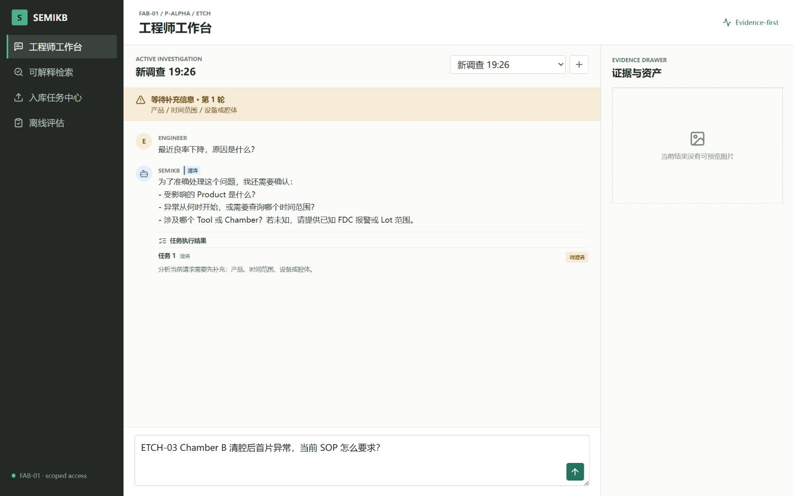
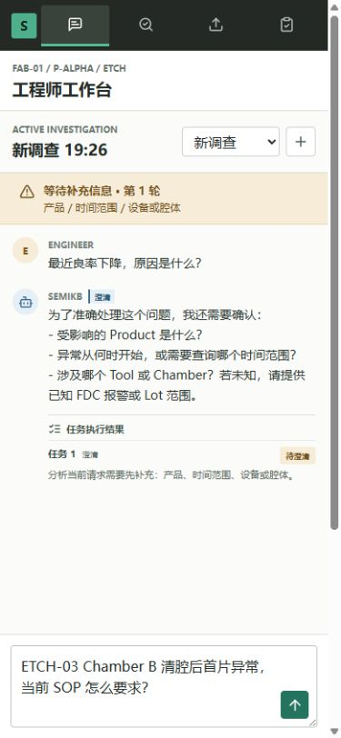

# T9-4.5.1 通用澄清状态机验收

## 1. 结论

T9-4.5.1 已按 A 到 G 的顺序完成影响面审计、兼容契约、恢复关系判定、LangGraph 闭环、展示审计、
自动化非回归和 ECS 浏览器验收。线程等待澄清时，新消息不再被无条件送入旧 Checkpoint，而是先被判定为
继续当前、取消当前、替换新任务、普通插话或歧义，再由服务端执行受控状态迁移。

T9-4/T9 仍未完成。本阶段没有进入 T9-4.6；后续容量与运行韧性开发仍须用户明确发出开始指令。

## 2. 实现范围

- 新增版本化 `semikb-clarification-frame-v1`，保存原问题、合法待解决项、已解决项、候选路由、轮次、
  签名、生命周期和最近迁移，不以拼接后的字符串作为唯一状态真相。
- 复用现有一次结构化 LLM 理解提供语义候选；服务端拥有最终关系、槽位、权限、路由和状态迁移权，
  没有增加第二次意图模型调用或新基础设施。
- 支持一次补齐、分轮补齐、部分/乱序补充、纠正、继续、取消、完整新任务替换、普通插话和歧义确认。
- 旧 MongoDB 文档、Trace 和 Checkpoint 通过适配器继续读取；终态 Frame 不会被重放或迟到恢复复活。
- 澄清、取消和普通插话显示自然气泡；RAG、Tool 和证据完成结果仍显示结构化卡片。

## 3. 线上发现与通用修复

浏览器验收额外发现了两类影响未知未来输入的问题：

1. 结构化 LLM 曾把半导体领域词“清腔”误判为 `cancel_scope=current_task`。服务端现仅在完整用户输入
   Grounding 到明确取消表达时接受取消候选，不能由模型单独制造取消状态。
2. 普通插话虽然进入 `chat_direct`，但执行态仍携带旧请求和任务结果。插话与取消分支现统一清理本轮
   request、任务结果和证据投影，同时保留暂停的 ClarificationFrame，避免旧卡片污染新气泡。

两项修复都有自动回归，生产逻辑没有绑定已知文件名、问题、答案、Chunk、标签或检索分数。

## 4. 自动化结果

- 后端全量：`399 passed, 1 warning`，唯一警告为既有 Starlette/httpx TestClient 弃用提示。
- 澄清评估：8 个场景、12 个回合全部通过。
- 澄清完成率、关系准确率、路由准确率：`1.0 / 1.0 / 1.0`。
- 新任务误吸收率、取消失效率、跨 Frame 污染率、重复澄清率：均为 `0`。
- 内部字段泄露率、信息未补齐时下游误调用率：均为 `0`。
- 平均澄清轮数：`0.5`；无进展轮次占比：`0.166666...`，对应受控未知/歧义场景，不产生重复追问。
- Ruff、前端 ESLint、TypeScript/Vite build、差异检查和凭据扫描通过。

冻结意图数据未被修改：

| 数据集 | Case | 路由准确率 | 危险执行漏拒 | 新 `history_direct` | SHA-256 |
| --- | ---: | ---: | ---: | ---: | --- |
| v1 | 96 | 1.0 | 0 | 0 | `01caa8a4fa2180e2dea19df3ea04da2cb80512f10bf10076d47c42dbce53b228` |
| v2 | 99 | 1.0 | 0 | 0 | `ad13bb6b49ff604f5e25eb1b27e85c6db2a7b455ee7b1d24fbcd9d85641b95be` |
| v3 | 108 | 1.0 | 0 | 0 | `e5f2f689655e0eccd945bb25eec49e167c2dc07db5436c6dc4d360fc38976679` |

## 5. ECS 与回滚

- 只重建 API、Worker 和 Web；API/Web healthy，Worker ping 返回 `pong`。
- 运行环境确认新开关为启用状态；独立关闭开关的回滚探针返回 `rollback_flag=False`，证明旧流程可回退。
- MongoDB、Milvus、项目 MinIO、Milvus MinIO、etcd、Redis 的完整容器 ID 前后完全一致：

| 服务 | 容器 ID |
| --- | --- |
| etcd | `9deab8ba18050f4f92bf9c18abe351093cb20e1ad849eca3d075b82e5a7837f6` |
| Milvus | `2f6827ca640e81452a9f368996b3d35b09797df7cda5315d92e26fdd2ab91afe` |
| Milvus MinIO | `6c9133e777d257b103dfa97ced473e27bab93ad15ccf9e27d05330d60146cf96` |
| 项目 MinIO | `54dab754141ecb1f3398bed22fc6df12fee23bab0b815f900234053a7139e590` |
| MongoDB | `e6bd110ad3202d8448b470f4e7085192377c757d7fd65c7975be748eb8f94770` |
| Redis | `ada0a643b6a62ba4d263337a80b580e1d70abb2127b03ba3a1e5004d1dae8fdd` |

本阶段没有数据库迁移、Milvus Collection/Alias 切换、Bucket 变化或数据容器重建。

## 6. 浏览器验收

公网工作台完成以下真实点击场景：

- 缺少 Product、时间和机台/腔室时建立第 1 轮合法 Frame；未补齐前不调用下游。
- 不显式说换题而直接输入完整 SOP 问题，旧 Frame 立即 `superseded`，新问题进入 `internal_rag`。
- 普通能力咨询自然回答，旧 Frame 暂停且不消耗轮次；“继续刚才”只恢复剩余澄清项。
- `P-ALPHA` 与“最近24小时，ETCH-03 Chamber B”分两轮积累，补齐后执行 `rag_and_tool`。
- “别查了”立即退出；“我想换个问题”先做歧义确认，后续新任务不继承旧槽位、证据或轮次。
- 刷新页面后原问题、Frame 和轮次从 Mongo Checkpoint 正确恢复。
- RAG/Tool 使用结构化卡片，直接回答/澄清/取消使用自然气泡；真实 SSE 和持久化文本一致。
- 桌面和实际 `390 x 844` 移动视口均无横向溢出，Console error/warning 为 0。

移动验收时浏览器内部视口为 `390 x 844`；截图工具输出 `375 x 812` 位图，因为浏览器扩展裁掉了
滚动条/浏览器框。验收以 DOM 的 `innerWidth=390`、`innerHeight=844` 和 `scrollWidth<=390` 为准。

## 7. 提交与边界

实现提交包括：

- `bb470ad` `Implement versioned clarification state machine`
- `e446681` `Guard clarification cancellation controls`
- `b26d70d` `Isolate side conversations from clarification state`

本阶段只完成 T9-4.5.1。T9-4.6、冷备、安全迁移和最终演示验收均未开始。
